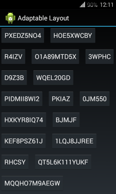

AdaptableLayout
=============

The layout that can arrange children automatically.

Usage:
---

Grab the latest version from `jcenter`:

    repositories {
        jcenter()
    }
    dependencies {
        compile 'com.github.lassana:adaptable-layout:1.0.0'
    }

In code:

    AdaptableLayout layout = (AdaptableLayout) view.findViewById(R.id.layout);
    layout.addView(button1);
    layout.addView(button2);
    layout.addView(button3);
    //...

